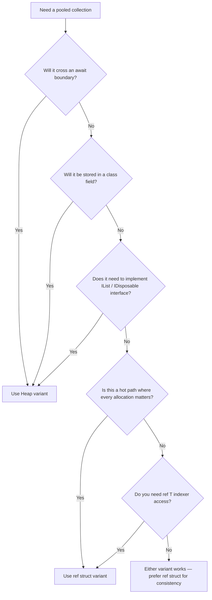

# Getting Started

ZeroAlloc.Collections is a zero-allocation collections library for .NET that provides six collection types optimized for hot-path scenarios. Each collection rents its backing storage from `ArrayPool<T>.Shared` and returns it on disposal, eliminating GC pressure from temporary buffers. Every type ships in two variants: a `ref struct` for stack-only, zero-heap-allocation use and a heap-allocated class for async code, DI containers, and long-lived fields.

## Installation

```bash
dotnet add package ZeroAlloc.Collections
```

The package targets `netstandard2.1`, `net8.0`, and `net9.0`. Source generators for specialized collection types are bundled automatically — no additional package reference is required.

## Your First Collection

The following walkthrough creates a `PooledList<int>`, adds items, iterates them, and disposes the list to return its buffer to the pool.

### Step 1 — Create a PooledList

Construct a `PooledList<T>` with an optional initial capacity. The list rents an array from `ArrayPool<T>.Shared` and grows automatically when the capacity is exceeded.

```csharp
using ZeroAlloc.Collections;

using var list = new PooledList<int>(capacity: 16);
```

The `using` declaration ensures `Dispose()` runs when the variable goes out of scope, returning the rented array to the pool.

### Step 2 — Add items

```csharp
list.Add(10);
list.Add(20);
list.Add(30);
```

If the list exceeds its capacity, it rents a larger array, copies the existing items, and returns the old array — identical to `List<T>` growth semantics, but backed by the pool instead of the GC heap.

### Step 3 — Read items

Access items by index, iterate with `foreach`, or obtain a `Span<T>` for zero-copy processing.

```csharp
// Index access
int first = list[0]; // 10

// Foreach (uses a ref struct enumerator — zero allocation)
foreach (var item in list)
{
    Console.WriteLine(item);
}

// Span access
ReadOnlySpan<int> span = list.AsReadOnlySpan();
```

### Step 4 — Dispose

When the `using` declaration completes (or you call `Dispose()` manually), the backing array is returned to the pool. After disposal, the list must not be used.

```csharp
// Automatic via 'using var', or:
list.Dispose();
```

### Full example

```csharp
using ZeroAlloc.Collections;

using var list = new PooledList<int>(capacity: 16);

list.Add(10);
list.Add(20);
list.Add(30);

foreach (var item in list)
{
    Console.WriteLine(item); // 10, 20, 30
}
// Buffer returned to ArrayPool when 'list' goes out of scope
```

## Choosing Between Ref Struct and Heap Variants

Every collection in ZeroAlloc.Collections ships in two forms:

| Aspect | Ref Struct (`PooledList<T>`) | Heap (`HeapPooledList<T>`) |
|--------|------------------------------|----------------------------|
| Allocation | Zero — lives on the stack | One object on the managed heap |
| Lifetime | Scoped to the declaring method | Can be stored in fields, returned from methods |
| Async | Cannot cross `await` boundaries | Safe in `async` methods |
| Interfaces | Cannot implement `IList<T>` | Implements `IList<T>`, `IReadOnlyList<T>`, `IDisposable` |
| Indexer | Returns `ref T` | Returns `T` |
| DI | Cannot be injected | Can be registered in a DI container |
| Performance | Fastest — no GC tracking | Near-identical throughput, one small GC root |

### Decision Flowchart



**Rule of thumb:** start with the `ref struct` variant. Switch to the `Heap*` variant only when the compiler tells you the ref struct cannot be used in that context — typically when crossing `await` boundaries or storing the collection in a class field.

## Key Concepts

### Pooling

All pooled collections (`PooledList`, `PooledStack`, `PooledQueue`, `RingBuffer`, `SpanDictionary`) rent their backing arrays from `ArrayPool<T>.Shared`. This avoids GC heap allocation for the storage buffer. You must call `Dispose()` (or use a `using` declaration) to return the array to the pool. Failing to dispose leaks the rented array, which degrades pool efficiency over time.

Every collection also accepts a custom `ArrayPool<T>` instance if you need isolated pools for different subsystems.

### Ref Struct vs Heap

Ref struct collections are `ref struct` types. The C# compiler enforces that they cannot escape the stack: they cannot be boxed, stored in fields, captured by lambdas, or used across `await` points. This is the mechanism that guarantees zero heap allocation — the compiler prevents the scenarios that would require one.

Heap variants are regular classes. They allocate a single object on the managed heap but still rent their internal storage from the pool. Use them when you need the collection to outlive a single method scope.

### Disposal

`Dispose()` returns the rented buffer to the pool and marks the collection as unusable. `Clear()` resets the count to zero without returning the buffer — use it when you want to reuse the same collection across loop iterations.

## Next Steps

| Page | What you will learn |
|------|---------------------|
| [PooledList](pooled-list.md) | Full API, growth strategy, `Span<T>` accessors, custom pools |
| [RingBuffer](ring-buffer.md) | Circular buffer mechanics, `TryWrite`/`TryRead`, bulk operations |
| [SpanDictionary](span-dictionary.md) | Open-addressing internals, `ref TValue` access, collision handling |
| [PooledStack & PooledQueue](stack-and-queue.md) | LIFO/FIFO patterns, `TryPop`, `TryDequeue` |
| [FixedSizeList](fixed-size-list.md) | Stack-allocated storage, compile-time capacity, overflow behavior |
| [Source Generators](source-generators.md) | `[ZeroAllocList<T>]`, `[PooledCollection<T>]`, custom enumerators |
| [Diagnostics](diagnostics.md) | Analyzer rules, suppression, and fixes |
| [Performance](performance.md) | Benchmark methodology, results vs BCL collections, Native AOT |
| [Testing](testing.md) | Test patterns, disposal verification, source generator testing |
